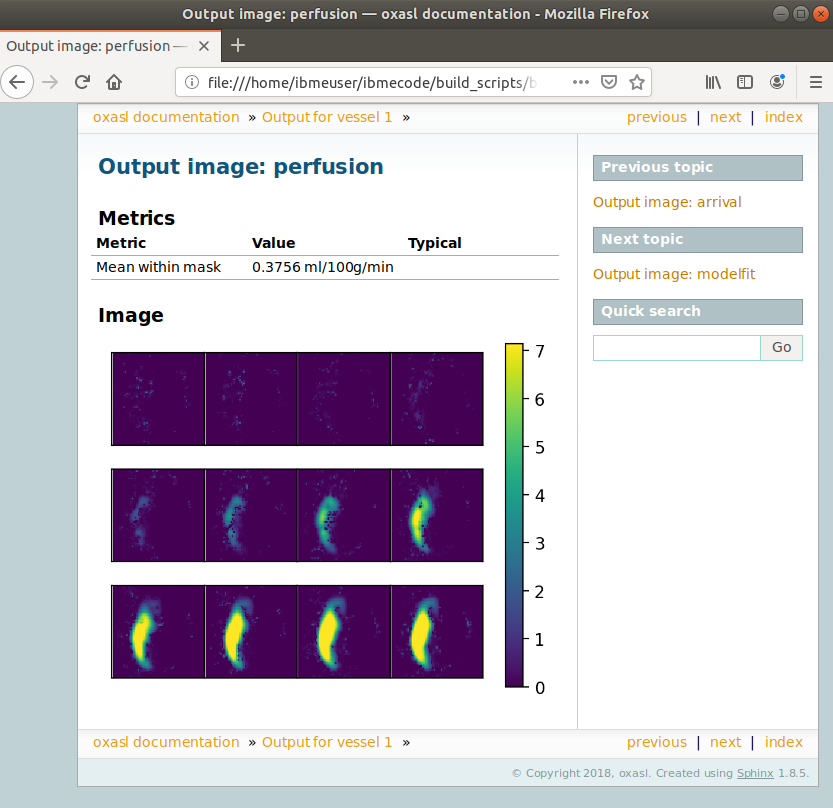

Example using vessel encoded pCASL data
=======================================

This example shows how to process vessel encoded pCASL data with OXASL.

Obtaining and installing ``VEASL``
~~~~~~~~~~~~~~~~~~~~~~~~~~~~~~~~~~

Vessel encoded ASL can only be processed when the ``VEASL`` tool for 
vessel decoding is installed. Currently we are not able to distribute
this tool publically, so if you are interested in processing VEPCASL data
please contact Michael Chappell (michael.chappell@eng.ox.ac.uk) to obtain 
a copy of the VEASL code.

VEASL must be installed in your path. The ideal installation locations are 
either:

 - ``$FSLDIR/bin`` if you have access to ``$FSLDIR``
 - ``$FSLDEVDIR/bin`` if you have defined ``$FSLDEVDIR``
 - Anywhere else in your default ``$PATH``

Running OXASL on VE data
~~~~~~~~~~~~~~~~~~~~~~~~

The key distinction between running VE data and regular ASL data is the ``--iaf`` option.
This should be set to one of:

 - ``--iaf=ve`` for raw VEPCASL data
 - ``--iaf=vediff`` for VEPCASL data which has undergone pairwise subtraction

In addition the following option must be provided for VE data:

 - ``--veslocs=<vessel locations file>``

The vessel locations file defines the initial locations for the encoded vessels - the
first row gives the X co-ordinates, the second row the Y co-ordinates. For example
this data defines 4 source vessels::

    -25  25 -25  25
    -13 -13 -24 -25

The encoding sequence is currently assumed to be determined from the estimated initial
vessel locations.

An example command line for multi-PLD VEPCASL data would be::

    oxasl -i mpld_asltc --casl --iaf=ve --ibf=tis --slicedt=0.0452 \
          --plds=0.25,0.5,0.75,1.0,1.25,1.5 --bolus=1.4 \
          --veslocs=veslocs.txt \
          -o oxasl_out

Other standard OXASL options can also be used to enable calibration, provide structural data,
or apply preprocessing corrections to the data.

Pairwise subtracted VE data
---------------------------

By using ``--iaf=vediff`` it is possible to process pairwise-subtracted VE data. In general
it is better to use the raw data, however some preprocessing strategies, such as denoising,
may be better applied to subtracted data, where the static signal has been removed. **It
is probably not a good idea to apply motion correction in this case as the subtracted images
may only show signal in parts of the brain**. Do motion correction prior to subtraction instead.

Additional common VE options
~~~~~~~~~~~~~~~~~~~~~~~~~~~~

``--nfpc=<Number of flows per class>``
--------------------------------------

VEASL can model the fact that each voxel may be fed by more than one vessel. A combination
of feeder vessels is called a *class*. This option defines the number of vessels per class.
The default value is 2.

``--infer-loc=none|xy|rigid``
-----------------------------

This option controls how the locations of the vessels are inferred. ``none`` means they
are fixed at their initial positions, ``xy`` means the X/Y co-ordinates are allowed to 
vary, and ``rigid`` infers a rigid body transformation of the co-ordinates. The default
is ``rigid``.

``--init-loc``
-------------

This option applies to multi-PLD data only. If specified an initial decoding run is
performed on the mean across all PLDs to determine vessel locations. By default these
vessel locations are then fixed when performing the vessel decoding on the individual
PLDs. It is possible to initialize the vessel locations on the mean data and *also*
infer them for each PLD using ``--init-loc`` together with the 
``--infer-loc-pld=none|xy|rigid`` option.

The log output
~~~~~~~~~~~~~~

The command line output is similar to the non-VE case, however there is an additional
vessel decoding step between the preprocessing and the kinetic model inversion, which will
look something like this (showing 1 PLD only)::

    Performing vessel decoding
    - Initial vessel locations:
    X: [-25.  25. -25.  25.]
    Y: [-13. -13. -24. -25.]

    - Encoding matrix:
    TWO
    0.0, 0.0, 0.0, 0.0
    0.0, 1.0, 0.0, 0.0
    90.0, 2.0, -25.0, 25.0
    90.0, 3.0, -25.0, 25.0
    0.0, 2.0, -13.0, -24.5
    0.0, 3.0, -13.0, -24.5
    13.495733280795811, 2.0, -18.475358737629833, -7.29290476485388
    13.495733280795811, 3.0, -18.475358737629833, -7.29290476485388
    MAC:
    0.0, 50.0, -0.0, -0.0, -3.0068078634963786, -0.3971255668768797
    0.0, 8.974483684827054e-08, -18.75, -7.25, -12.52836611276087, -1.6546898639495466
    0.0, 0.0, 270.0, 270.0, 76.5042667192042, 76.5042667192042
    25.0, 25.0, 5.75, 5.75, 5.591226986387976, 5.591226986387976

    - Fitting PLD 1
    - Vessel locations (inference: rigid):
        X: [-24.36777377  25.63201797 -24.39952284  25.59738261]
        Y: [-14.52208469 -14.66639867 -25.52203887 -26.66634868]
        Translation: 0.616, -1.59  Rotation: -0.165 (degrees)
    - Class proportions:
        [0.46011736 0.06254921 0.04755664 0.03730842 0.07797115 0.31449723]

    DONE vessel decoding

The subsequent kinetic model inversion will then be performed on each vessel individually
marked by the log messages::

    Processing per-vessel decoded images

    - Processing vessel 1
    ...etc

After each vessel has been individually model fitted, the output is combined for all 
vessels::

    Generating combined images for all vessels

Output images
~~~~~~~~~~~~~

The output images are as usual found in the ``oxasl_out/output`` directory, however there is an additional
layer not present for non-VE data. The ``all_vessels`` subdirectory contains the output for all vessels
combined, while the ``vessel<n>`` directories contain the individual vessel outputs.

The usual OXASL output images are produced, for example:

 - ``perfusion.nii.gz`` - This is the relative perfusion image
 - ``arrival.nii.gz`` - This is the inferred bolus arrival time image
 - ``aCBV.nii.gz`` - This is the inferred macrovascular signal image containing arterial volume fraction as a percentage
 - ``mask.nii.gz`` - This is the binary brain mask used in the analysis

Calibrated outputs are also produced if calibration data is supplied, and structural space outputs are
also produced where structural data is available.

How all-vessel output images are combined
-----------------------------------------

The combination of single-vessel data into all-vessel data is not completely trivial. The
following methods are used:

 - For perfusion and macrovascular signal data, the output of the individual vessels is summed
 - For arrival time and variance/STD outputs, the combined output is a weighted average of the
   individual vessels, weighted by the relative perfusion contribution from each vessel in
   each voxel.

Summary report
~~~~~~~~~~~~~~

The summary report will contain, alongside the usual information, separate output images for
each vessel and the combined output images:

