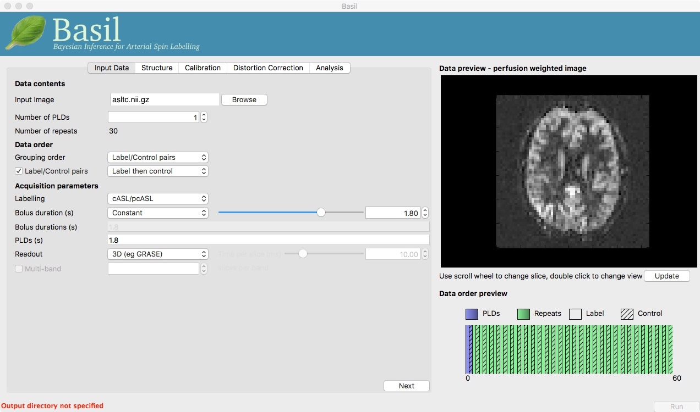
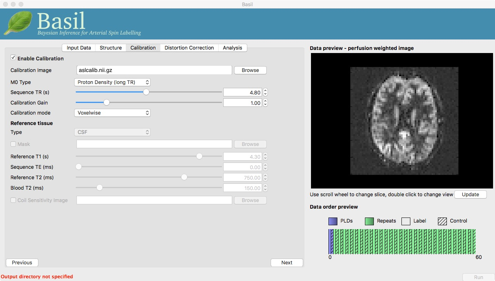
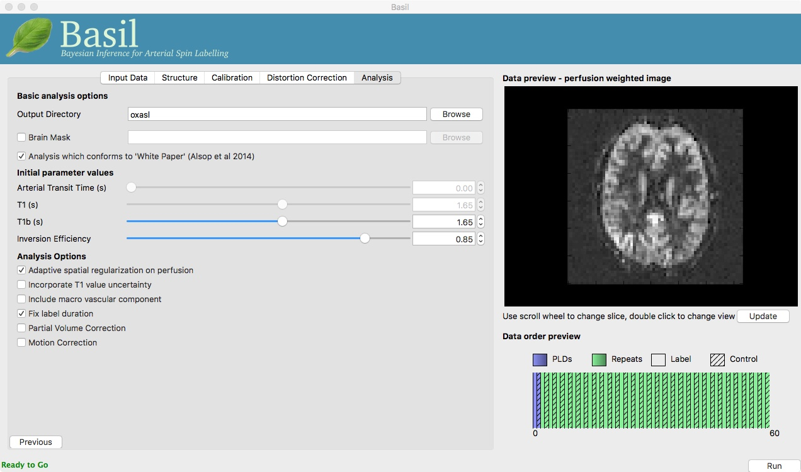
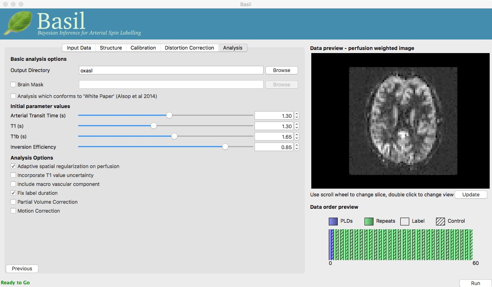
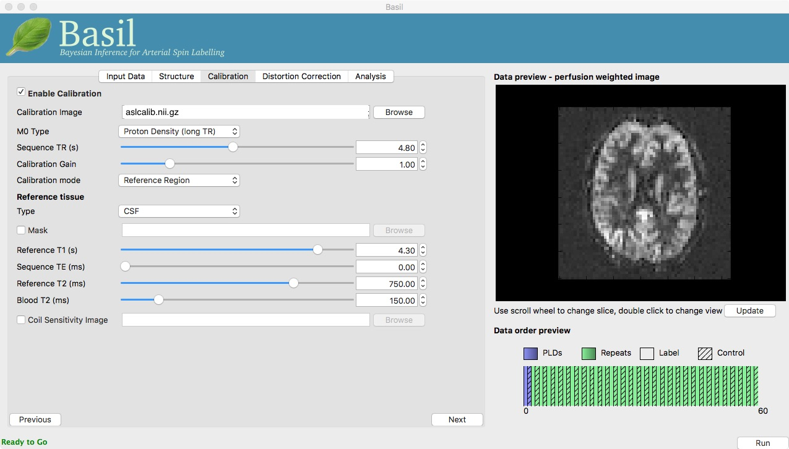
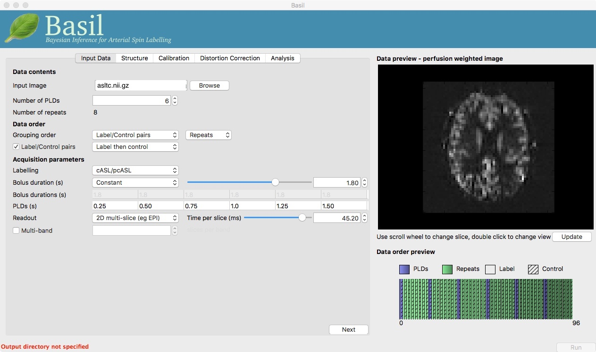
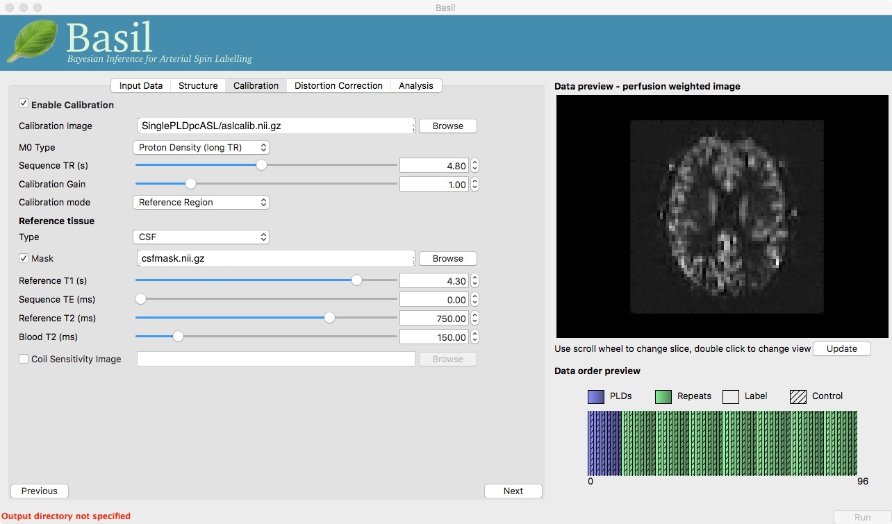

Arterial Spin Labelling Practical
=================================

In this practical you will learn how to use the BASIL tools in FSL
to analyse ASL data, specifically to obtain quantitative images of
perfusion (in units of ml/100 g/min), as well as other haemodynamic
parameters. For the puproses of the practical you will be instructed
to use the BASIL GUI, all of the same analyses (and more) can be
achieved using command line tools, as you will see in the
accompanying lecture. 

This practical is a shorter version of the
examples that accompany the Primer: Introduction to Neuroimaging
using Arterial Spin Labelling. On the website for the primer you can
find more examples than we have time for on the FSL course,
including instructions for using both the GUI and command line
tools.

http://www.neuroimagingprimers.org/examples/introduction-primer-example-boxes/

NOTE that if you are following this practial outside of the FSL
course you should ensure you are using the pre-release of BASIL
alongside a recent version of FSL v5. This can be found by following
a link from the FSL website:

https://fsl.fmrib.ox.ac.uk/fsl/fslwiki/BASIL

.. contents:: Contents
    :local:

Perfusion quantification using Single PLD pcASL
-----------------------------------------------

The aim of this exercise is to perform perfusion quantification
with one of the most widely recommened variants of ASL. Single PLD
pcASL is now regarded as sufficiently simple and reliable, both for
acquisition and analysis, that it is the first option most people
should consider when using ASL for the first time. Although more can be done with other ASL variants,
particularly when acquisition time allows.

The data
~~~~~~~~

Take a look inside the data directory::

    cd ~/fsl_course_data/ASL
    ls

This dataset used **pcASL labeling** and we are going to start
with data collected using a **single post-label delay**. This dataset 
follows as closely as possible the
recommendations of the ASL Consensus Paper (commonly called the
'White Paper') on a good general purpose
ASL acquisition, although we have chosen to use a 2D mutli-slice
readout rather than a full-volume 3D readout.

The files you will need to begin with are:

  - ``spld_asltc.nii.gz`` - the label-control ASL series containing 60
    volumes. That is 30 label and 30 control, in pairs of alternating images with
    label first. 
  - ``aslcalib.nii.gz`` - the calibration image, a (largely) proton-density
    weighted image with the same readout (resolution etc) as the main
    ASL data. The TR for this data is 4.8 seconds, which means there
    will be some T1 weighting. 
  - ``aslcalib_PA.nii.gz`` - another calibration image,
    identical to ``aslcalib.nii.gz`` apart from the use of
    posterior-anterior phase encoding (anterior-posterior was used in
    the rest of the ASL data). This is provided for distortion
    correction. 
  - ``T1.nii.gz`` - the T1-weigthed anatomical of the same
    subject. 

Look at the data
~~~~~~~~~~~~~~~~

It is always a good idea to take a look at the raw data just to
check that nothing has gone horribly wrong in the acquisition and
ensure you know exactly what you are dealing with. 

There are two separate files that contain the ASL data we need:

  - ``spld_asltc.nii.gz`` 
  - ``aslcalib.nii.gz``  

View these images in fsleyes::

    fsleyes aslcalib.nii.gz -dr 0 1500 spld_asltc.nii.gz -dr 0 1500

Notice that:

  - There is a marked intensity difference between the calibration image and the label-control data. This is because background suppression was applied when acquiring the label-control data, as recommended by the ASL consensus paper, to reduce the influence of motion and physiological noise sources. 
  - It is very hard to spot differecnes between label and control
    images - try using the movie mode of fsleyes, you might find it
    helpful to set the display range for the ``spld_asltc.nii.gz`` image as 0 to
    500 now. 
  - There is an alternating pattern in the timeseries of the
    label-control data, but it is small compared to the mean signal
    intensity in any given voxel. To see this use the timeseries mode in
    fsleyes, you will need to choose a voxel in cotrical gray matter
    (where there will be the largest perfusion signal) e.g. [20,14,13]. 
 
.. note:: 
    If movie mode does not seem to work in FSLeyes, try turning off
    ``Synchronise movie updates`` in the View Settings window (accessed
    by clicking on the spanner icon).

A Perfusion-Weighted Image
~~~~~~~~~~~~~~~~~~~~~~~~~~

Since the data looks okay we can proceed to the calculation of a
perfusion-weighted image (PWI). For this we will use the 'preview'
feature of the BASIL GUI, essentially we are generating the PWI to check
that the data is okay for further analysis.

To launch the GUI at the command line you will need to type
``asl_gui``. Note that if you have downloaded the
'pre-release' yourself, you may need to provide a path to the
installed version of the GUI, e.g. ``/Users/{blah}/Downloads/oxford_asl/asl_gui``

Once it has launched you
will find yourself on the 'Input Data' tab, you
should:

  - Load the ASL data ``spld_asltc.nii.gz`` as the 'Input Image'. 
  - Set the 'Number of PLDs', which in this case is 1, this is already done by default. 
  - Click the 'Update' button beneath the 'Data Preview' pane on the right. 

At this point the GUI should look like the screen shot below* and
a PWI will have appeared in the 'Data Preview' pane. This this is reassuring, if we didn't see something that
looks roughly like this, we might check if the data order that the
GUI is expecting matches that in the data. We could alter the 'Data
order' settings if needed and update the preview again. 

.. note::
    If the image does not update automatically after clicking
    'Update' try re-sizing the GUI window slightly and that should force
    it to redraw.

    
Note also, beneath the 'Data Preview', that there is a 'Data order
preview'. The idea of this graphic is to help visually to confirm
that the way that the GUI is intepreting the ordering of volumes in
the data matches what you are expecting. In this case we have a
single PLD repeated 30 times with the label and control images
paired in the data (this is pretty common). What the 'Data order
preview' shows is the first instance of the PLD in purple, showing
both the label and control (hatched) volume. Each subsequent repeat
of the same PLD is coloured green, again showing that we have a
label follwed by control (hatched) volume.

You can try a different 'Data order' option to see what
happens. Change 'Label/Control pairs' from 'Label then control' to
'Control then label'. This switches the expected order of label and
control images within the pair. If you then udpate the preview you
will find that the contrast reverses, the perfusion now has the
wrong 'sign'.
 
(Simple) Perfusion Quantification
~~~~~~~~~~~~~~~~~~~~~~~~~~~~~~~~~

We have checked the PWI, thus we
can proceed to final quantification of perfusion, inverting the
kinetics of the ASL label delivery and using the calibration
image to get values in the units of ml/100g/min.

To do this we need to tell the BASIL GUI some information about the
data and the analysis we want to perform.

On the 'Input Data' tab we need to sepcify the 'Acquisition parameters':

  -  Labelling - cASL/pcASL (the deafult option). 
  -  Bolus duration (s) - 1.8 (default). 
  -  PLDs (s) - 1.8 (default). 
  -  Readout - 2D multi-slice (you will need to set this). 
  -  Time per slice (ms) - 45.2 (only appears when you change the Readout option). 

You can now hit 'Next' and you will be taken to the next tab. For
this (simple) analysis we do not want to use a structural image, so
we can move on by clicking 'Next' again. Or we could skip stright to
the 'Calibration' tab using the menu across the top.

On the 'Calibration' tab, 'Enable Calibration' first, then load
the calibration image ``aslcalib.nii.gz``. Change the
'Calibration mode' to 'voxelwise', and set the 'Sequence TR (s)' to
be 4.8.

Finally, we need to set the analysis options: either skip to the
'Analysis' tab or click 'Next' twice.

On the 'Analysis' tab, choose an output directory name, e.g.,
``oxasl``. And, select 'Analysis which conforms to White
Paper', so that we know the analysis is using the same default
parameter values proposed in the 'ASL White Paper' quantification
formula. Note that in the lower left corner the GUI is now telling
us that we are 'Ready to Go'. At this point you can click 'Run' in
the lower right corner.

The output of the oxford_asl command line tool is shown in a 
pop-up window. You can ignore any ``erfc underflow error`` messages
- they are harmless and occur because we haven't provided any
structural data

*This analysis should only take a few minutes, but while you are
waiting you can read ahead and even start changing the options in
the GUI ready for the next analysis that we want to run.*

Once the analysis had completed, view the final result::

    fsleyes oxasl/native_space/perfusion_calib.nii.gz

Note that if you just supply a name for the output directory (not
a full path), as we have here, this will be placed in the 'working
directory', i.e. whichever directory you were in when you launched
the GUI.

You will find something that looks very similar to the PWI we viewed before, but now the values at every voxel are in ml/100g/min.

You will also find a PWI saved as
``oxasl/native_space/perfusion``. This is very similar to the
PWI displayed in the preview pane, except that the kinetic
model inversion has been applied to it, this is the image
pre-calibration.

Improving the Perfusion Images from single PLD pcASL
----------------------------------------------------

The purpose of this practical is essentially to do a better job of
the analysis we did above, exploring more of the features of the GUI
including things like motion and distortion correction.

Motion and Distortion correction
~~~~~~~~~~~~~~~~~~~~~~~~~~~~~~~~

Go back to the GUI which should still be setup from the last
analysis you did (if you have closed it follow the steps above to
repeat the setup - but do not click run).

On the 'Distortion Correction' tab, select 'Apply distortion
correction'. Load the 'Phase-encode-reveresed calibration image'
``aslcalib_PA.nii.gz``. Set the 'Effective EPI echo
spacing' (also known as the dwell time) to 0.95ms and the 'Phase encoding direction' to 'y'.

 .. image:: practical/Dist.jpeg
     :alt: BASIL GUI previewing perfusion-weighted image

On the 'Analysis' tab, select 'Motion Correction'. Make sure you
have 'Adaptive spatial regularisation on perfusion' selected (it is
by default). This will reduce the appearance of noise in the final
perfusion image using the
minimum amount of smoothing appropriate for the data.

You might like
the change the name of the output directory at this point, so that
you can comapre to the previous analysis.

Now click 'Run'.

 .. image:: practical/Analysis2.jpeg
     :alt: BASIL GUI Analysis

For this analysis we are still in 'White
Paper' mode. Specifically this means we are using
the simplest kinetic model, which assumes that all delivered blood-water has
the same T1 as that of the blood and that the Arterial Transit Time should be
treated as 0 seconds.

*As before, the analysis should only take a few minutes, slightly
longer this time due to the distortion and motion correction. Like the
last exercise you might want to skip ahead and start setting up the
next analysis.*

To view the final result::

    fsleyes oxasl/native_space/perfusion_calib.nii.gz

The result will be similar to the analysis in Example 1 although the effect of distortion
correction should be noticeable in the anterior portion of the
brain. The effects of motion correction are less obvious, this
data does not have a lot of motion corruption in it.

Making use of Structural Images
~~~~~~~~~~~~~~~~~~~~~~~~~~~~~~~

Thus far, all of the analyses have relied purely on the ASL data
alone. However, often you will have a (higher resolution) structural
image in the same subject and would like to use this as well, at the
very least as part of the process to transform the perfusion images into some
template space.

We can repeat the analysis above but now providing structural
information. The recommended way to do
this is to take your T1 weighted structural image (which is most
common) and firstly process using ``fsl_anat``, passing the
output directly from that tool BASIL. 

For this practical ``fsl_anat`` has already been run for
you and you will find the output in the data directory as ``~/fsl_course_data/ASL/T1.anat``

Go back to the analysis you have setup above. On the 'Structure'
tab, for 'Structural data from' select 'Existing FSL_ANAT
output'. Then for the 'Existing FSL_ANAT output' choose
``T1.anat``. 

 .. image:: practical/Struct.jpeg
     :alt: BASIL GUI Structure

*This analysis will take somewhat longer overall (potentailly
15-20 mins), the extra time
is taken up doing careful registration between ASL and structural
images. Thus, this is a good point to keep reading on and leave the
analysis runnning.*

You will find some new results in the output
directory:

  - ``oxasl/struct_space`` - this sub-drectory contains results
    transformed into the same space as the structural image. The
    files in here will match those in the ``native_space``
    subdirectory of the earlier analysis, i.e., containing perfusion
    images with and without calibration. 
  - ``oxasl/native_space/asl2struct.mat`` - this is the
    (linear) transformation between ASL and structural space. It can be
    used along with a transformation between structural and template
    space to transform the ASL data into the template space. It was used
    to create the results in ``oxasl/struct_space``. 
  - ``oxasl/native_space/perfusion_calib_gm_mean.txt`` -
    this contains the result of calculating the perfusion within a gray
    matter mask, these are in ml/100g/min. The mask was derived from the partial volume estimates
    created by ``fsl_anat`` and transformed into ASL space
    followed by thresholding at 70%. This is a helpful check on the
    absolute perfusion values found and it is not aytpical too see
    values in the range 30-50 here. There is also a white matter result
    (for which a threshold of 90% was used). 
  - ``oxasl/native_space/gm_mask.nii.gz`` - this is the gray
    matter mask used in the above calculations. There is also the
    associated white matter mask. 
  - ``oxasl/native_space/gm_roi.nii.gz`` - this is another
    mask that represents areas in which there is some grey matter (at
    least 10% from the partial volume estimates). This can be useful for
    visualisation, but mainly when looking at partial volume corrected
    data. 
 
Different model and calibration choices
~~~~~~~~~~~~~~~~~~~~~~~~~~~~~~~~~~~~~~~

Thus far the calibration to get perfsion in units of ml/100g/min
has been done using a voxelwise division of the realtive perfusion
image by the (suitably corrected) calibration image - so called
'voxelwise' calibration. This is in keeping with the recommendations
of the ASL White Paper for a simple to implement quantitative
analysis. However, we could also choose to use a reference tissue to
derive a single value for the equilibrium magnetization of arterial
blood and use that in the calibration process.

Go back to the analysis you have already set up. We are now going
to turn off 'White Paper' mode, this will provide us with more
options to get a potentially more accurate analysis. To do this return to the 'Analysis' tab
and deselect the 'White Paper' option, you will see that the
'Arterial Transit Time' goes from 0 seconds to 1.3 seconds (the
default value for pcASL in BASIL based on our experience with pcASL
labeling plane placement) and the 'T1' value (for tissue) is
different to 'T1b' (for arterial blood), since the Standard (aka
Buxton) model for ASL kinetics considers labeled blood both in the
vascualture and the tissue.

Now that we are not in 'White Paper' mode we can also change the
calibration method. On the 'Calibration' tab, change the 'Calibration mode' to 'Reference
Region'. Now all of the 'Reference tissue' options will become
available, but leave these as they are: we will accept the default
option of using the CSF (in the ventricles) for calibration.

You could click 'Run' now and wait for the analysis to
complete. But, in the interests of time we will save ourselves the
bother of doing all of the registration all over again. Before
clicking run, therefore, do:

  - On the 'Calibration' tab select 'Mask' and load
    ``csfmask.nii.gz`` from the data directory. This is a ready
    prepared ventricular mask for this subject. (in fact it is precisely
    the mask you would get if you ran the analysis as setup above). 
  - Go back to the 'Structure' tab and choose 'None' for 'Structural
    data from'. This will turn off all of the registration
    processes. 
  - You might also like to choose a different output directory name,
    so that you can comapre with the previous analysis. 
 
*While this is running you might want to read ahead, or if you
are keen to keep moving through the examples, then skip this
analysis and keep going.*

The resulting perfusion images should look very similar to those
produced using the voxelwise calibration, and the absolute values
should be similar too. For this, and many datasets, the two methods
are broadly equivalent. You can check on some of the interim
calcuations for the calibration by looking in the
``oxasl/calib`` subdirectory: here you will find the value
of the estimated equilirbirum mangetization of arterial blood for
this dataset in ``M0.txt`` and the reference tissue mask in
``refmask.nii.gz``. It is worth checking that the latter
does indeed only lie in the venticles when overlaid on an ASL image
(e.g. the perfusion image or the calibration image), it should be
conservative, i.e., only select voxels well within the ventricles
and not on the boundary with white matter.

Partial Volume Correction
~~~~~~~~~~~~~~~~~~~~~~~~~

Having dealt with structural image, and in the process obtained
partial volume estimates, we are now in a position to do partial
volume correction. This does more than simply attempt to estimate
the mean perfusion within the grey matter, but attempts to derive and
image of gray matter perfusion directly (along with a separate image
for white matter).

This is very simple to do via the GUI. Return to your earlier
analysis. You will need
to revist the 'Structure' tab and reload the ``T1.anat``
result as you did above, the partial volume estimates produced by
``fsl_anant`` (in fact they are done using ``fast``)
are needed for the correction. On the 'Analysis' tab,
select 'Partial Volume Correction'. That is it! You might not want to
click 'Run' at this point becuase partial volume correction takes
substantially longer to run.

You will find the results of this analysis already completed for
you in the directory ``~/fsl_course_data/ASL/oxasl_spld_pvout``. In this results directory you will still find an analysis performed
without partial volume correction in ``oxasl/native_space``
as before. The results of partial volume correction can be found in
``oxasl/native_space/pvcorr``. This new subdirectory has the
same structure as the non-corrected results, only now
``perfusion_calib.nii.gz`` is an estimate of perfusion only
in gray matter, it has been joined by a new set of images for the
estimation of white matter perfusion, e.g.,
``perfusion_wm_calib.nii.gz``. It may be more helpful to look at
``perfusion_calib_masked.nii.gz`` (and the equivalent
``perfusion_wm_calib_masked.nii.gz``) since this has been
masked to include only voxels with more than 10% gray matter (or white
matter), i.e., voxels in which it is reasonable to interpret the gray
matter (white matter) perfusion values.

Perfusion Quantification (and more) using Multi-PLD pcASL
---------------------------------------------------------

The purpose of this exercise is to look at some multi-PLD pcASL. As
with the single PLD data we can obtain perfusion images, but now we
can account for any differences in the arrival of labeled blood-water
(the arterial transit time, ATT) in different parts of the brain. As we
will also see we can extract other interesting parameters, such as the
ATT in its own right, as well as arterial blood volumes.

The data
~~~~~~~~

The data we will use in this section supplements the single PLD pcASL data above, adding
multi-PLD ASL in the same subject (collected in the same
session). This dataset used the same pcASL labelling, but with a
label duration of 1.4 seconds and 6 post-labelling delays of 0.25,
0.5, 0.75, 1.0, 1.25 and 1.5 seconds.

The files you will also now need are:

  - ``mpld_asltc.nii.gz`` - the label-control ASL series
    containing 96 volumes: each PLD was repeated 8 times, thus there are
    16 volumes (label and control paired) for each PLD. The data has
    been re-ordered from the way it was acquired, such that all of the
    measurements from each PLD have been grouped together - it is
    important to know this data ordering when doing the analysis.  

Perfusion Quantification
~~~~~~~~~~~~~~~~~~~~~~~~

Load the GUI (``asl_gui``), it is best to start a
whole new analysis as we are moving on to a new set of data and not
reuse any GUI you already have open. On the
'Input Data' tab, for the 'Input Image' load
``mpld_asltc.nii.gz``. Unlike the single-PLD data, we need to specify the correct number
of PLD, which is 6. At this point the 'Number of repeats' should
correctly read 8. Click 'Update' below the 'Data preview pane'. A
perfusion-weighted image should appear - this is an average over all
the PLDs (and will thus look different to Example 1).

Note the 'Data order preview'. For mutli-PLD ASL it is important
to get the data order specification right. In this case the default
options in the GUI are not correct. The PLDs do come as label-control
pairs, i.e. alternating label then control images. But, the default
assumption in the GUI is that a full set of the
6 PLDs has been acquired first, then this has been repeated 8
subseqeunt times, this is indcated in the preview by colouring the
first instance of a PLD as purple and subsequent as green, with
different PLDs appearing as different shades of purple (or
green). This is quite commonly how multi-PLD ASL data is acquired,
but that might not be how the data is ordered in the final image
file.

As we noted earlier, in this data all of the measurements at the
same PLD are grouped together. You need to change the 'Grouping
order' on the 'Input Data' tab: leave the first option along
('Label/Control pairs') and change the second option from 'PLDs' to
'Repeats'. Note that the data order preview changes to reflect the
different ordering. This is now correct: remeber that the purple
coloured entries indicate the first time that PLD was acquired.

Note that if you were to click 'Update' on the 'Data preview' nothing
changes, the ordering doesn't affect the (simple) way in which we
have calucated the PWI. Getting a plausible looking PWI is a good sign that the data
order is correct, but it is not a guarantee that the PLD ordering is
correct, so always check carefully. One way to do this, in this
case, would be to open the data in ``fsleyes`` and look at
the timeseries: the raw intensity of both label and control images
for one PLD are different to those from another PLD (due to the
background suprresion). THe timeseries for the raw data looks like a
series of steps, indicating the repeated measurements from each PLD
are grouped together (groubed by 'repeats').

Once we are happy with the PWI and data order, we can set the
'Acquisition parameters':

  - Labelling - 'cASL/pcASL' (default). 
  - Bolus duration (s) - 1.4 (shorter than the default). 
  - PLDs (s) - 0.25, 0.5, 0.75, 1.0, 1.254, 1.5.  
  - Readout - '2D multi-slice' with 'Time per slice' 45.2. 
 
Move to the 'Calibration' tab, select 'Enable Calibration' and as
the 'Calibration Image' load the ``aslcalib.nii.gz`` image
from the Single-PLD data (it is from the same subject in the same
session so we can use it here too). We have skipped the 'Structure'
tab (to make the analysis quicker), this means if we want 'Calibration
mode' to be 'Reference Region' we need to supply a mask of the
region of tissue to use. Select 'Mask' and load
``csfmask.nii.gz``. Set the 'Sequence TR' to be 4.8, but
leave all of the other options alone.

Move to the 'Distortion Correction' tab. Select 'Apply distortion
correction'. Load the 'Phase-encode-reveresed calibration image'
``aslcalib_PA.nii.gz`` from the Single-PLD pcASL data. Set the 'Effective EPI echo
spacing' to 0.95ms again and the 'Phase encoding direction' to 'y'.

Finally, move to the 'Analysis' tab. Choose an output directory,
leave all of the other options alone. Click 'Run'.

*This analysis shouldn't take a lot longer than the equivalent
single PLD analysis, but feel free to skip ahead to the next section
whilst you are waiting.*

The results directory from this analysis should look similar to
that obtained for the single PLD pcASL. That is reassuring as it is the same subject. The main difference is the
``arrival.nii.gz`` image. If you examine this image you should find a pattern of values
that tells you the time it takes for blood to transit between the
labeling and imaging regions. You might notice that the
``arrival.nii.gz`` image was present even in the single-PLD
results, but if you looked at it contained a single value - the one
set in the Analysis tab - which meant that it
appeared blank in that case.

Arterial/Macrovascular Signal Correction
~~~~~~~~~~~~~~~~~~~~~~~~~~~~~~~~~~~~~~~~

In the analysis above we didn't attempt to model the presence of
arterial (macrovascular) signal. This is fairly
reasonable for pcASL in general, since we can only start sampling
some time after the first arrival of labeled blood-water in the
imaging region. However, given we are using shorter PLD in our
multi-PLD sampling to improve the SNR there is a much greater
likelihood of arterial signal being present. Thus, we might like to
repeat the analysis with this component included in the model.

Return to your analysis from before. On the 'Analysis' tab select
'Include macro vascular component'. Click 'Run'.

The results directory should be almost identical to the
previous run, but now we also gain some new results:

  - ``aCBV.nii.gz`` and
  - ``aCBV_calib.nii.gz``

Following the convention for the
perfusion images, these are the relative and absolute arterial
(cerebral) blood volumes respectively. If you examine one of these
and focus on the more inferior slices you should see a pattern of
higher values that map out the structure of the major arterial
vasculature, including the Circle of Willis. This finding of an
arterial contribution in some voxels results in a correction to the
perfusion image - you may now be able to spot that in the same
slices where there was some evidence for arterial contamination of
the perfusion image before that has now been removed.

Partial Volume Correction
-------------------------

In the same way that we could do
partial volume correction for single PLD pcASL, we can do this
for multi-PLD. If anything partial volume correction should be even
better for multi-PLD ASL, as there is more information in the data to
separate grey and white matter perfusion.

Just like the single PLD case we will require structural
information, entered on the 'Structure' tab. We can do as we did
before and load ``T1.anat``. On the 'Analysis' tab, select
'Partial Volume Correction'.

Again, this analysis will not be very quick and so you might not
wish to click 'Run' right now.

You will find the results of this analysis already completed for
you in the directory
``~/fsl_course_data/ASL/oxasl_mpld_pvout``. This results directory contains, as a further subdirectory, ``pvcorr``,
within the ``native_space`` subdirectory, the partial volume
corrected results: gray matter (``perfusion_calib.nii.gz``
etc) and white matter perfusion
(``perfusion_wm_calib.nii.gz`` etc)
maps. Alongside these there are also gray and white matter ATT maps
(``arrival`` and ``arrival_wm`` respectively). The
estimated maps for the arterial component
(``aCBV_calib.nii.gz`` etc) are still present in the
``pvcorr`` directory. Since this is not tissue specific there
are not separate gray and white matter versions of this parameter.

The End.
