.. _CLI:

OXASL walk through tutorial - command line
==========================================

This tutorial demonstrates some of the common options available in the OXASL command line tool.

We will be working with multi-PLD data from the 
`FSL tutorial on Arterial Spin Labelling <https://fsl.fmrib.ox.ac.uk/fslcourse/lectures/practicals/ASLpractical/index.html>`_.
You will need to download this data before following the tutorial.

The tutorial has been written so that we start with the most basic analysis and gradually add
options and show the effect they have on the output, as well as how they are reported in the
command log and the summary report. However this is not a complete description of all available
options - for that see the :ref:`CLref`.

The data
~~~~~~~~

The data is from a multi-PLD pCASL acquisition with a bolus duration of 1.4s and post-labelling delays
(PLDs) PLDs every 0.25s up to 1.5s. The acquisition was 2D with an increase in the PLD per slice of
0.0452s.

Basic run without calibration or structural data
~~~~~~~~~~~~~~~~~~~~~~~~~~~~~~~~~~~~~~~~~~~~~~~~

In this case we only need specify the structure and acquisition parameters for our ASL data::

    oxasl -i mpld_asltc --casl --iaf=tc --ibf=tis --slicedt=0.0452 \
          --plds=0.25,0.5,0.75,1.0,1.25,1.5 --bolus=1.4 \
          -o oxasl_out

Here the ``--iaf=tc`` option indicates that the data contains tag-control pairs. ``--ibf=tis`` indicates 
that the TC pairs are stored in blocks corresponding to each TI/PLD, so the first two volumes are 
tag/control for PLD=0.25, while the next two volumes are repeats at the *same PLD*. 

If the data instead consisted of label-control pairs for *all* the PLDs followed by another block of 
repeated images at *all* the PLDs, this would be indicated using ``--ibf=rpt`` (blocks of repeats).

``-o oxasl_out`` sets the output directory.

The log output
^^^^^^^^^^^^^^

The command line outputs (hopefully) helpful information on it's progress - to redirect this to
a file you could add ``>output_log`` to the command line above. In this case it appears as
follows::

    OXASL version: 0.0.7.dev12
    - Found plugin: oxasl_ve (version 0.0.7.dev2)
    - Found plugin: oxasl_deblur (version 0.0.1)
    - Found plugin: oxasl_enable (version 0.0.1.dev6)

    Input ASL data: asldata
    Data shape                    : (64, 64, 24, 96)
    Label type                    : Label-control pairs
    Labelling                     : CASL/pCASL
    PLDs (s)                      : [0.25, 0.5, 0.75, 1.0, 1.25, 1.5]
    Repeats at each TI            : [8, 8, 8, 8, 8, 8]
    Bolus durations (s)           : [1.4, 1.4, 1.4, 1.4, 1.4, 1.4]
    Time per slice (s)            : 0.0452

This is the program reporting its current version and some useful information about the ASL
data you have given::

    Initialising structural data
    - No structural data supplied - output will be native space only

    Applying preprocessing corrections
    - Data transformations
    - No corrections to apply

    No motion correction

    Applying preprocessing corrections
    - Data transformations
    - No corrections to apply

    No fieldmap images for distortion correction

    No CBLIP images provided for distortion correction

    Calculating Sensitivity correction
    - No source of sensitivity correction was found

    Applying preprocessing corrections
    - Data transformations
    - No corrections to apply

Next the preprocessing step is performed which involves performing any required corrections.
In this case there is nothing to do, but it goes through the motions anyway::

    Getting the ASL image to use for registration)
    - Registration reference is mean ASL signal (brain extracted)

    Generated ASL data mask
    - Mask generated from brain extracted registration ASL image

Now the mask is generated - it first checks to see if there is structural data but there isn't
so the mask comes from the mean ASL signal::

    Running BASIL Bayesian modelling on ASL data
    - Doing initial fit on mean at each TI

    BASIL v0.0.7.dev12
    Data shape                    : (64, 64, 24, 6)
    Label type                    : Already differenced
    Labelling                     : CASL/pCASL
    PLDs (s)                      : [0.25, 0.5, 0.75, 1.0, 1.25, 1.5]
    Repeats at each TI            : [1, 1, 1, 1, 1, 1]
    Bolus durations (s)           : [1.4, 1.4, 1.4, 1.4, 1.4, 1.4]
    Time per slice (s)            : 0.0452
    Model (in fabber) is : aslrest
    Dispersion model option is none
    Compartment exchange model option is mix
    Step 1 of 3: VB -  Tissue  100%
    Step 2 of 3: VB -  Tissue  Arterial  - Initialise with step 1 100%
    Step 3 of 3: Spatial VB -  Tissue  Arterial  - Initialise with step 2 100%

    End

    - Doing fit on full ASL data

    BASIL v0.0.7.dev12
    Data shape                    : (64, 64, 24, 96)
    Label type                    : Label-control pairs
    Labelling                     : CASL/pCASL
    PLDs (s)                      : [0.25, 0.5, 0.75, 1.0, 1.25, 1.5]
    Repeats at each TI            : [8, 8, 8, 8, 8, 8]
    Bolus durations (s)           : [1.4, 1.4, 1.4, 1.4, 1.4, 1.4]
    Time per slice (s)            : 0.0452
    Model (in fabber) is : aslrest
    Dispersion model option is none
    Compartment exchange model option is mix
    Step 1 of 3: VB -  Tissue  100%
    Step 2 of 3: VB -  Tissue  Arterial  - Initialise with step 1 100%
    Step 3 of 3: Spatial VB -  Tissue  Arterial  - Initialise with step 2 100%

    End

This section is doing the actual modelling to determine the perfusion and arrival maps. 
The modelling is initially done on data that has been averaged at each PLD. The results
of this are used to initialize a second run with all the repeats available separately.
The fitting process proceeeds in three steps - the first to fit tissue parameters 
(perfusion and arrival), the second adds the arterial component, and the final step
performs spatial regularization::

    Generating HTML report
    - Report generated in /home/ibmeuser/data/asl/fsl_course/ASL/oxasl_out/report

    Output is /home/ibmeuser/data/asl/fsl_course/ASL/oxasl_out
    OXASL - done

Finally an HTML report is generated which will be described below. This may not occur
if you do not have the ``sphinx-build`` program installed.

Output images
^^^^^^^^^^^^^

Output images can be found in the oxasl_out/output/native directory and should contain the following
files:

 - ``perfusion.nii.gz`` - This is the relative perfusion image
 - ``arrival.nii.gz`` - This is the inferred bolus arrival time image
 - ``aCBV.nii.gz`` - This is the inferred macrovascular signal image containing arterial volume fraction as a percentage
 - ``mask.nii.gz`` - This is the binary brain mask used in the analysis

The perfusion map should be viewed to ensure it looks like a perfusion image - it should show
good WM/GM contrast, for example see the image below:

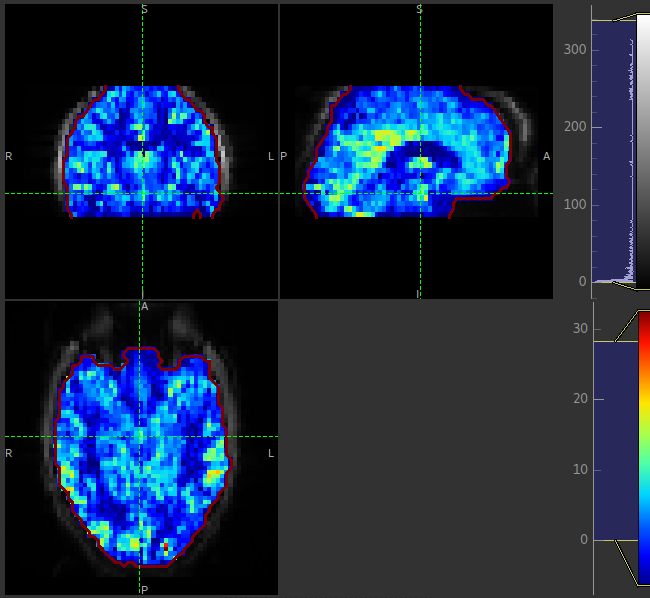

The arrival image is generally more uniform but may show delayed arrival at the posterior and superior
regions:

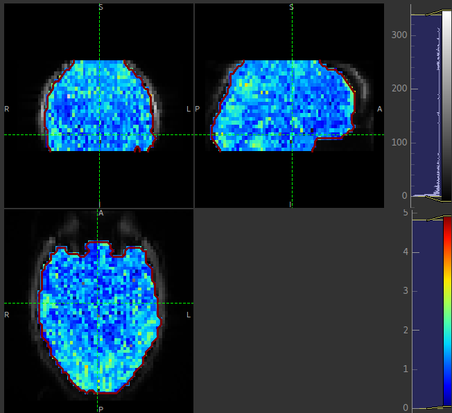

The macrovascular component should be limited to major arteries. To view a good image set the display
range in your viewing software to 0-100 and view a slice through the circle of Willis:

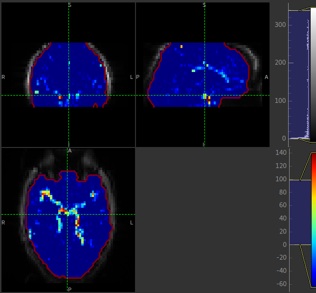

Summary report
^^^^^^^^^^^^^^

If a summary report was generated, it will be stored in the ``report`` subdirectory. Open the file
``index.html`` in a Web browser to see the report:

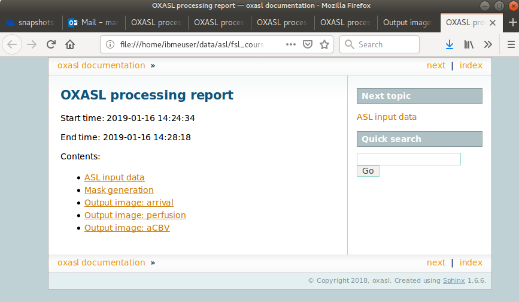

Each link provides some summary or visual representation of that part of the processing. For example
we can see how good the brain mask generated was:

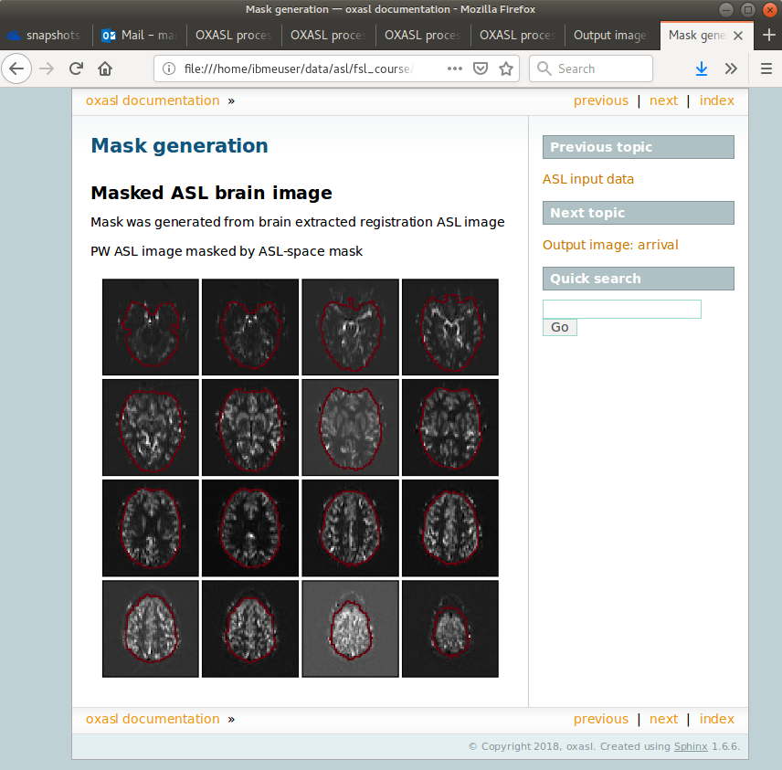

In this example the other pages in the report are not that interesting, but some of the more
complex examples below generate useful information in the report.

Adding structural information
~~~~~~~~~~~~~~~~~~~~~~~~~~~~~

By providing structural information we get the following benefits:

 - Better brain extraction 
 - Output in both native (ASL data) space and also in structural space for overlaying onto structural image
 - Possibility of automatic reference-region calibration (with calibration image, see below)
 - Possibility of partial volume correction (see below)

Structural data may be supplied as a T1 weighted image or, better, an output folder from the FSL_ANAT
command run on a structural image. This is preferred because the structural image is already segmented
and bias-corrected so these steps do not need to be done by OXASL. If a structural image is supplied
directly the FSL FAST segmentation tool will be used to do a structural segmentation which can be
a slow process. Here we use FSL_ANAT output::

    oxasl -i mpld_asltc --casl --iaf=tc --ibf=tis --slicedt=0.0452 \
          --plds=0.25,0.5,0.75,1.0,1.25,1.5 --bolus=1.4 \
          --fslanat T1.anat --senscorr \
          -o oxasl_out --overwrite

``--senscorr`` indicates that the bias-correction field from the FSL_ANAT should be used. We have also
added the ``--overwrite`` option - otherwise OXASL will refuse to run since the output 
directory already exists from our previous run.

Log output
^^^^^^^^^^

The log output contains a few additional pieces of information. We will just highlight the
differences rather than showing the entire log::

Firstly, we are using the structural image as the basis of our brain mask, and registering the
ASL and structural images to each other::

    Getting the ASL image to use for registration)
      - Registration reference is mean ASL signal (brain extracted)

    Registering ASL data to structural data
      - Registering image: regfrom using FLIRT
      - ASL->Structural transform
    [[ 9.99993443e-01 -3.06986241e-03 -1.90982874e-03 -1.71159280e+01]
    [ 3.05030371e-03  9.99943733e-01 -1.01611035e-02 -6.20556631e+00]
    [ 1.94091448e-03  1.01552118e-02  9.99946535e-01  3.53589818e+01]
    [ 0.00000000e+00  0.00000000e+00  0.00000000e+00  1.00000000e+00]]
      - Structural->ASL transform
    [[ 9.99993485e-01  3.05030364e-03  1.94091453e-03  1.70661166e+01]
    [-3.06986253e-03  9.99943711e-01  1.01552116e-02  5.79359551e+00]
    [-1.90982884e-03 -1.01611039e-02  9.99946567e-01 -3.54528364e+01]
    [ 0.00000000e+00  0.00000000e+00  0.00000000e+00  1.00000000e+00]]

    Generated ASL data mask
      - Mask generated from brain extracting structural image and registering to ASL space

We are also performing a sensitiviy correction using the bias field from the FSL_ANAT
output::

    Calculating Sensitivity correction
      - Sensitivity image calculated from bias field

Finally, after the modelling steps are complete, the ASL->Structural registration is
improved using BBR (Boundary Based Registration) which uses the output perfusion map 
because this has good WM/GM contrast. This means output in structural space will be
better aligned to the structural image::

    Registering ASL data to structural data
      - BBR registration using epi_reg
      - ASL->Structural transform
    [[ 9.99985245e-01 -3.27267408e-03  4.33140408e-03 -1.71764269e+01]
    [ 3.23107063e-03  9.99948863e-01  9.57749342e-03 -6.65767001e+00]
    [-4.36252543e-03 -9.56335410e-03  9.99944806e-01  4.26785518e+01]
    [ 0.00000000e+00  0.00000000e+00  0.00000000e+00  1.00000000e+00]]
      - Structural->ASL transform
    [[ 9.99985284e-01  3.23107076e-03 -4.36252668e-03  1.73838719e+01]
    [-3.27267442e-03  9.99948967e-01 -9.56335721e-03  7.00926763e+00]
    [ 4.33140255e-03  9.57749029e-03  9.99944701e-01 -4.25380300e+01]
    [ 0.00000000e+00  0.00000000e+00  0.00000000e+00  1.00000000e+00]]

Output images
^^^^^^^^^^^^^

The native output should be much the same as the previous example (possibly with a slightly
different brain mask). However we now also have output in structural space in the ``output/struct``
subdirectory. These images are transformed into the same space as the structural image so they
can easily be overlaid onto the structural image. e.g. this perfusion image:

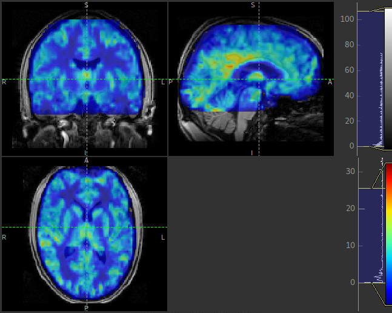

Summary report
^^^^^^^^^^^^^^

The initial and final ASL->Structural registrations are presented in the report as a matrix, 
summary transformation parameters and an overlay of GM/WM segmentations onto the original
ASL data. These should align pretty well, particularly the final registration.

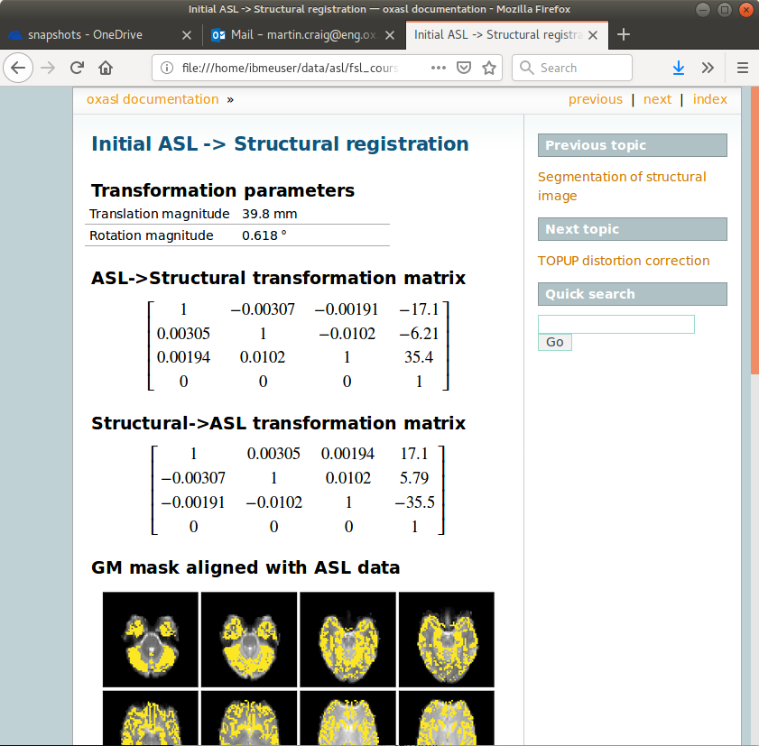

The report also includes a page showing the segmentation of the structural image into
WM, GM and CSF. This may be important to check if you are using partial volume correction.

Adding calibration
~~~~~~~~~~~~~~~~~~

Calibration enables the output of perfusion maps in physical units, enabling cross-subject and 
cross-session comparisons::

    oxasl -i mpld_asltc --casl --iaf=tc --ibf=tis --slicedt=0.0452 \
          --plds=0.25,0.5,0.75,1.0,1.25,1.5 --bolus=1.4 \
          --fslanat T1.anat --senscorr \
          -c aslcalib --tr=4.8 --cmethod=single  \
          -o oxasl_out --overwrite

The calibration image is specified using ``-c aslcalib``. ``--cmethod=single`` indicates that we
want to use a single M0 value for calibration, derived from a reference region. By default OXASL
uses CSF from the ventricles, identified by registering the structural image to a standard 
brain image and using this to mask the ventricles from the CSF segmentation output from either
FAST or (in this case) FSL_ANAT. ``--tr=4.8`` allows a correction to be made for differing T1
value in the tissue and reference. TE can also be similarly provided to correct for differing T2
values but we are not doing this for this example.

Log output
^^^^^^^^^^

The first part of calibration consists in calculating the tissue ``M0`` magnetisation value.
This occurs before the modelling step as it depends only on the calibration image::

    Calibration - calculating M0
      - Doing reference region calibration
      - Acquisition: TE=0.000000, TR=4.800000, Readout time (TAQ)=0.000000
      - Using tissue reference type: csf
      - T1r: 4.300000; T2r: 750.000000; T2b: 150.000000; Part co-eff: 1.150000
      - Doing automatic ventricle selection using standard atlas
      - Masking FAST output with standard space derived ventricle mask
      - Transforming tissue reference mask into ASL space
      - Thresholding reference mask
      - Number of voxels in tissue reference mask: 224
      - MODE: longtr
      - Calibration gain: 1.000000
      - mean signal in reference tissue: 1116.398541
      - T1 correction factor: 1.486980
      - T2 correction factor: 1.000000
      - M0: 1443.532699

The T1 correction factor is based on our supplied ``--tr`` value. The T2 correction factor is
1 because we did not supply a ``--te`` value. 

After modelling has been done the output perfusion maps can then be scaled using this M0
value. There is also a presumed value for the inversion efficiency which differs between
PASL and pCASL, and a fixed multiplier to convert the answer into physical units - for 
perfusion this is ``ml/100g/min``

    Calibrating perfusion data: perfusion
      - Using inversion efficiency correction: 0.850000
      - Using multiplier for physical units: 6000.000000
      - Applying sensitivity correction

    Calibrating perfusion data: aCBV
      - Using inversion efficiency correction: 0.850000
      - Using multiplier for physical units: 100.000000

Output images
^^^^^^^^^^^^^

Calibrated images are stored with the suffix ``__calib``, e.g. ``aCBV_calib`` and 
``perfusion_calib``.

Since reference region calibration scales the output perfusion map by a constant M0 value, 
the ``perfusion_calib`` image looks identical to the ``perfusion`` image but the value 
range is different and should be comparable between different calibrated scans.

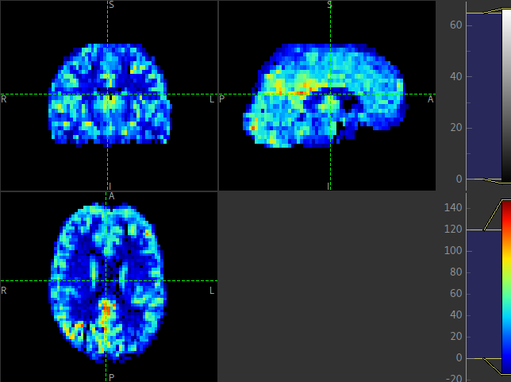

Summary report
^^^^^^^^^^^^^^

Reference region calibration involves isolation of a particular tissue type in the
calibration image - usually CSF from the ventricles. The report presents the steps
taken to identify this region which should be checked to ensure that what it thinks
are the ventricles really are. For example in this case this is the final reference
mask:

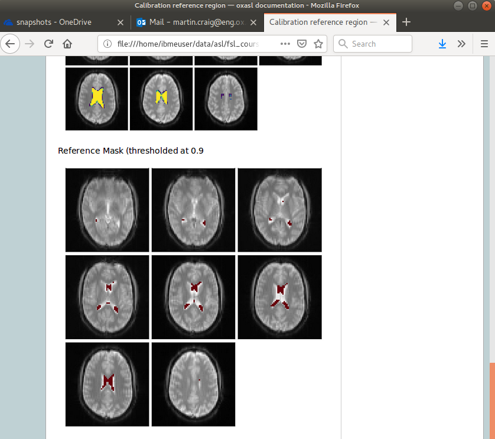

Note that this process is intended to identify voxels which are close to 100% CSF.
It is not intended to identify the whole of the ventricles and the number of 
voxels selected may be quite small.

The report also presents average perfusion values in GM and WM with the normal ranges, 
so we can check things are roughly as we'd expect:

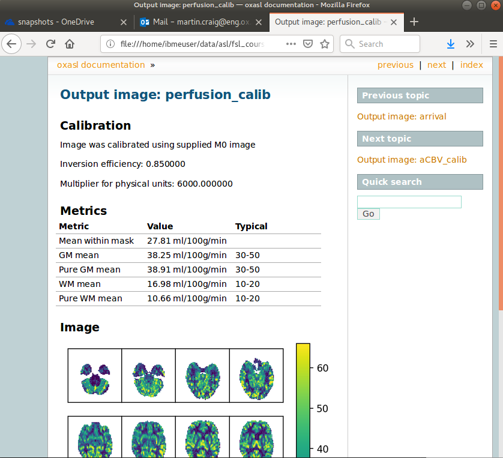

Distortion correction
~~~~~~~~~~~~~~~~~~~~~

In this case a phase-encoding reversed calibration image (`Blipped` image) was obtained which 
can be used to apply distortion correction using the FSL TOPUP tool::

    oxasl -i mpld_asltc --casl --iaf=tc --ibf=tis --slicedt=0.0452 \
          --plds=0.25,0.5,0.75,1.0,1.25,1.5 --bolus=1.4 \
          --fslanat T1.anat --senscorr \
          -c aslcalib --tr=4.8 --cmethod=single  \
          --cblip=aslcalib_PA --echospacing=0.00952 --pedir=y \
          -o oxasl_out --overwrite

The echo spacing (also known as the dwell time) is given in seconds and the phase encoding direction 
must also be given ``--pedir=y``. Normally this corresponds to scanner co-ordinates, however it is
important to view the results of distortion correction to make sure it is as expected.

Log output
^^^^^^^^^^

Distortion correction is performed as part of the preprocessing steps. Note that this is a 
multi-step process and distortion correction happens at the end::

    Calculating distortion Correction using TOPUP

    Calculating Sensitivity correction
      - Sensitivity image calculated from bias field
    
    Applying preprocessing corrections
      - Pre-processing image: calib
      - Pre-processing image: cblip
      - Data transformations
      - No corrections to apply
      - Adding TOPUP distortion correction
      - Applying sensitivity correction
    
Output images
^^^^^^^^^^^^^

The effect of distortion correction can be subtle. The image below show a slice from the 
perfusion map with distortion correction enabled (right image) and disabled (left image).
The largest difference is at the anterior end which corresponds to ``--pedir=y``.

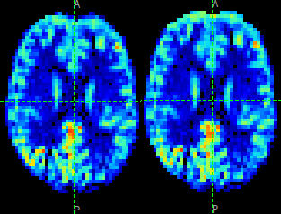

Summary report
^^^^^^^^^^^^^^

The summary report includes a page presenting distortion correction images however
these are not currently easy to interpret so we will not present them here.

Partial volume correction
~~~~~~~~~~~~~~~~~~~~~~~~~

.. warning::
    Partial volume correction adds considerably to the run time of OXASL!

Partial volume correction is enabled using the ``--pvcorr`` option. It uses the
GM/WM segmentation from the structural data to model the GM and WM contributions
separately, weighted according to the tissue proportions in each voxel::

    oxasl -i mpld_asltc --casl --iaf=tc --ibf=tis --slicedt=0.0452 \
          --plds=0.25,0.5,0.75,1.0,1.25,1.5 --bolus=1.4 \
          --fslanat T1.anat --senscorr \
          -c aslcalib --tr=4.8 --cmethod=single  \
          --cblip=aslcalib_PA --echospacing=0.00952 --pedir=y \
          --pvcorr \
          -o oxasl_out --overwrite

Log output
^^^^^^^^^^

Partial volume correction is not currently very well described in the log. It occurs
after the main model fit has been performed, and the final stage registration (using
the perfusion weighted image) has occurred. This is important - accurate PVC requires
a good registration to the structural image which provides the GM and WM partial volumes.

If the data mask was generated from the structural image, it is first recreated to account
for the final ASL->Structural registration. The model fitting is then run again with 
PVC enabled in the final step, and with an initialization step for the PVC parameters 
which uses the structural segmentation::

    Generated ASL data mask
      - Mask generated from brain extracting structural image and registering to ASL space

    Running BASIL Bayesian modelling on ASL data

    - Doing fit on full ASL data

    BASIL v0.0.7.dev19
    Data shape                    : (64, 64, 24, 96)
    Label type                    : Label-control pairs
    Labelling                     : CASL/pCASL
    PLDs (s)                      : [0.25, 0.5, 0.75, 1.0, 1.25, 1.5]
    Repeats at each TI            : [8, 8, 8, 8, 8, 8]
    Bolus durations (s)           : [1.4, 1.4, 1.4, 1.4, 1.4, 1.4]
    Time per slice (s)            : 0.0452
    Model (in fabber) is : aslrest
    Dispersion model option is none
    Compartment exchange model option is mix
    Step 1 of 4: VB -  Tissue  100%
    Step 2 of 4: VB -  Tissue  Arterial  - Initialise with step 1 100%
    Step 3 of 4: PVC initialisation - Initialise with step 2     Initialising partial volume correction...
    DONE
    Step 4 of 4: Spatial VB -  Tissue  Arterial  PVE - Initialise with step 3 100%

Note the PVC initialisation in Step 3, and the PVE component in Step 4.

Output images
^^^^^^^^^^^^^

The main differenec is that the perfusion image is split between GM (``perfusion_calib``) and
WM (``perfusion_wm_calib``). Both should only be interpreted within the corresponding segmentation - 
outside these regions (e.g. in WM regions when viewing the GM perfusion map), the image will be 
smooth and lacking in detail - reflecting the lack of information in the data for this region.
This is visible in the images below (Top: GM, Bottom: WM).

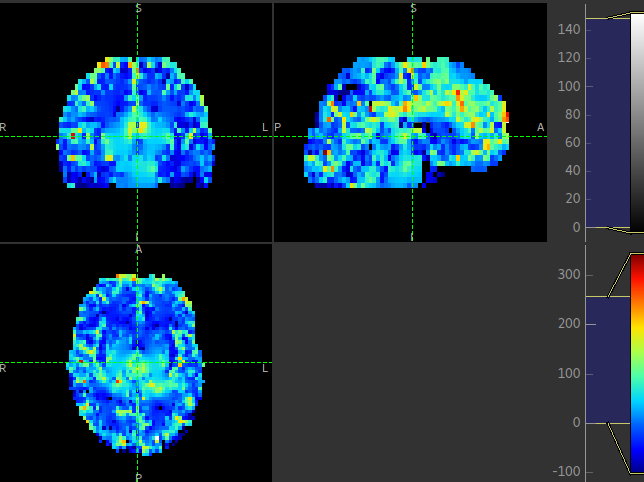

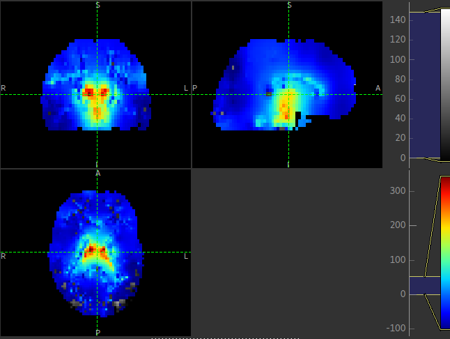

Summary report
^^^^^^^^^^^^^^

In the summary report, it is important to disregard the WM averages in the GM perfusion map, and
vice versa:

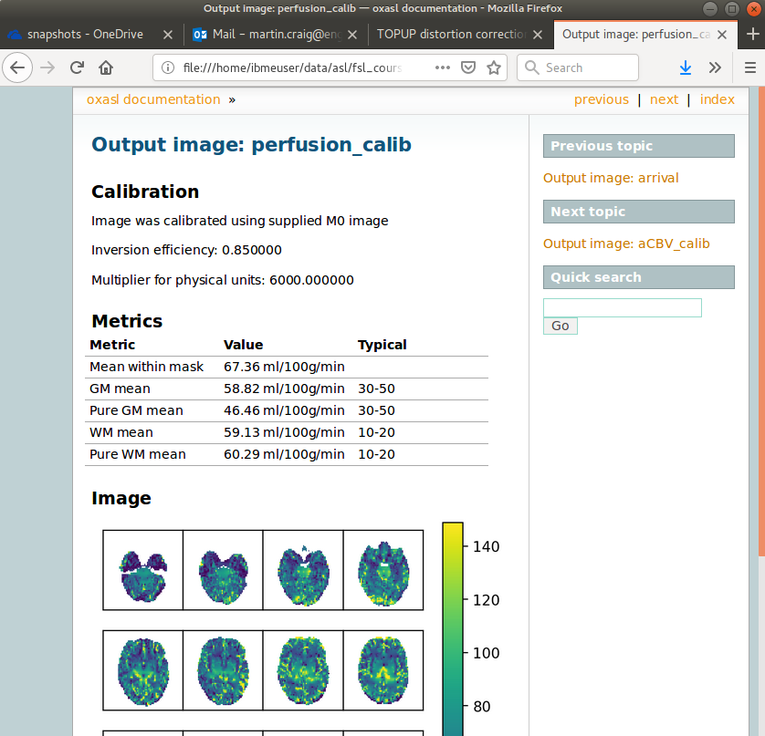

